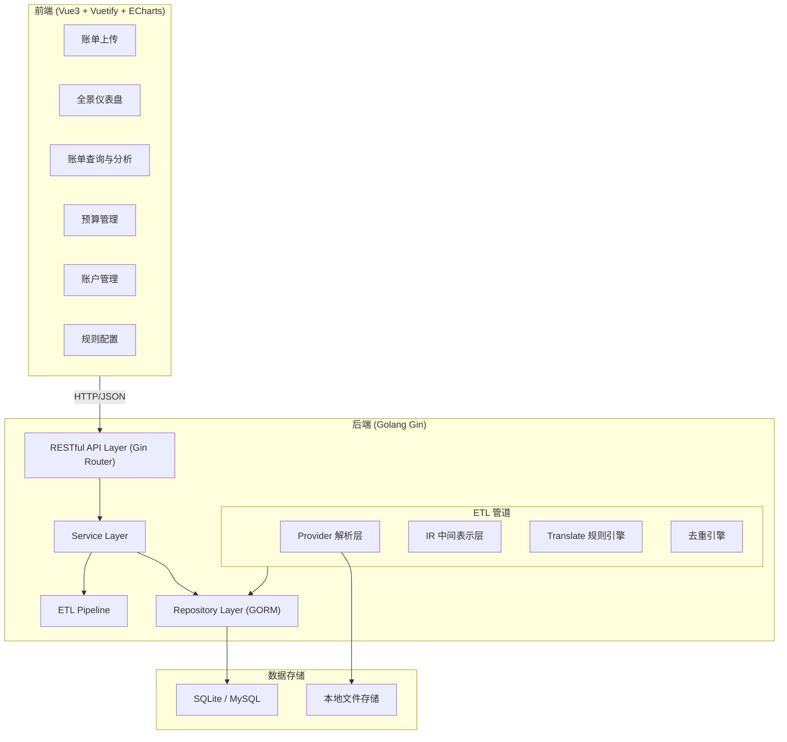
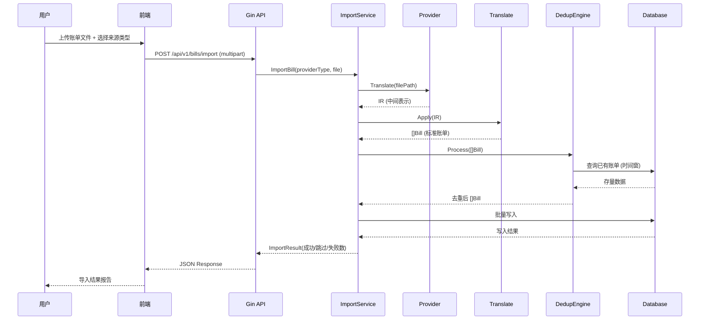
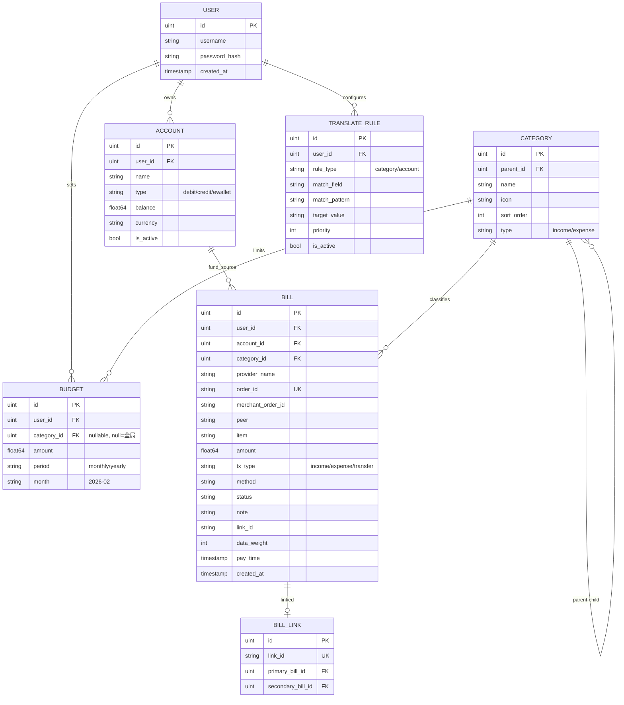
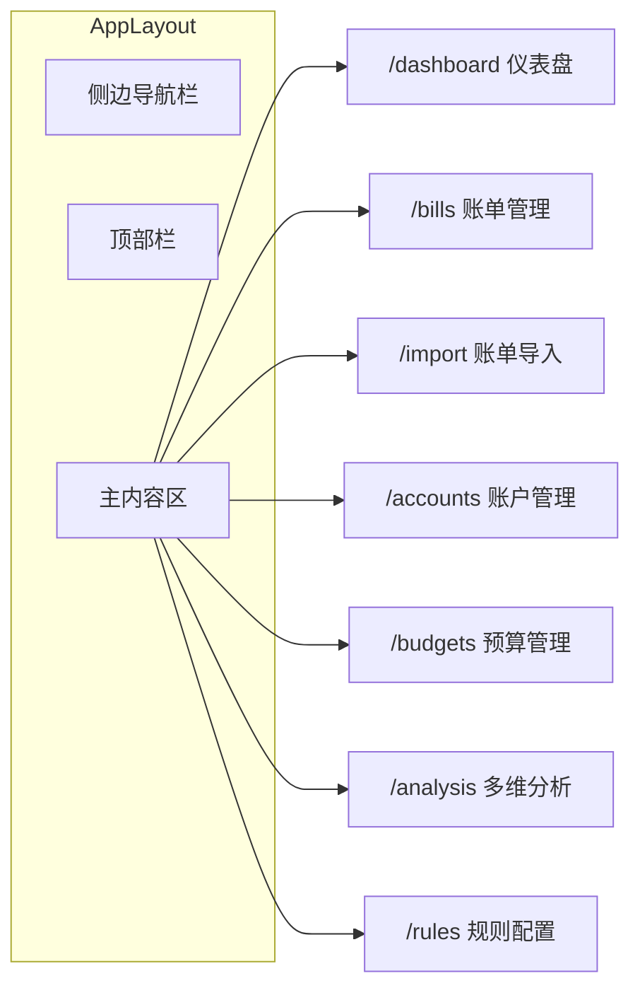
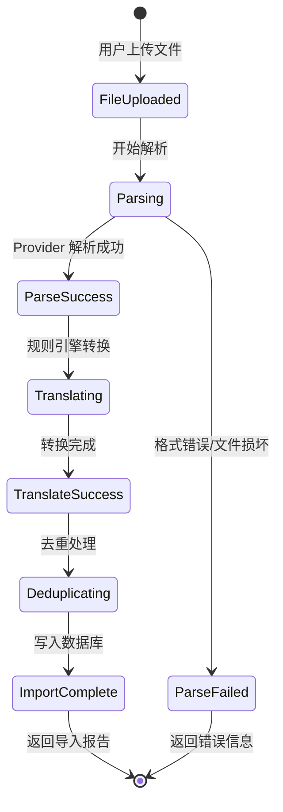
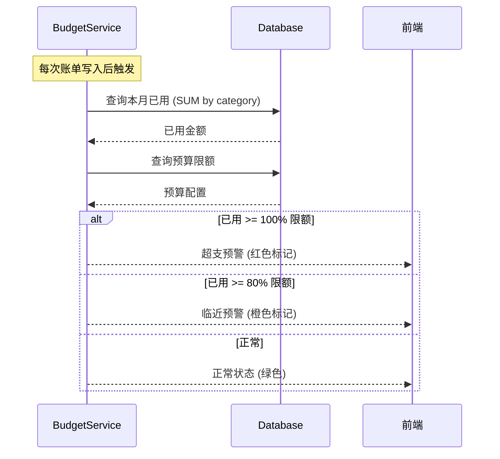
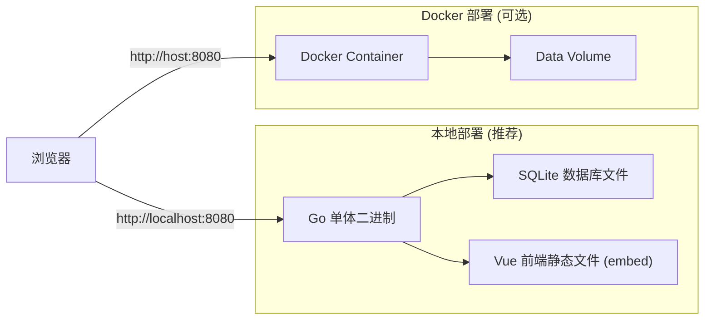

# 系统详细设计说明书 (DDS): ProjectMoneyX 个人全景财务分析系统

| 文档属性 | 详情 |
| --- | --- |
| **项目名称** | ProjectMoneyX |
| **版本号** | v1.0 |
| **编制日期** | 2026-02-26 |
| **文档状态** | 初稿 |
| **技术栈** | Golang (Gin + GORM) / Vue3 + TypeScript + Vuetify / ECharts |
| **参考项目** | [double-entry-generator](https://github.com/deb-sig/double-entry-generator) |

---

## 1. 系统总体架构

### 1.1 架构概览

系统采用前后端分离的 B/S 架构，后端以 Golang Gin 框架提供 RESTful API，前端以 Vue3 + Vuetify 构建 SPA 应用。核心数据处理流程借鉴 `double-entry-generator` 的 **Provider → IR → Translate** 管道模式，将其从命令行工具改造为 Web 服务。



### 1.2 分层架构说明

| 层级 | 职责 | 技术选择 |
| --- | --- | --- |
| **展现层 (Presentation)** | UI 渲染、用户交互、数据可视化 | Vue3 + Vuetify + ECharts |
| **API 层 (API Gateway)** | 路由分发、参数校验、认证鉴权、响应封装 | Gin Framework |
| **业务层 (Service)** | 核心业务逻辑编排、ETL 流程调度 | Go Service |
| **数据处理层 (ETL Pipeline)** | Provider 解析、IR 转换、Translate 规则、去重合并 | Go (参考 double-entry-generator) |
| **数据访问层 (Repository)** | ORM 映射、数据库 CRUD | GORM |
| **数据存储层 (Storage)** | 持久化存储 | SQLite (默认, Local-First) / MySQL (可选) |

---

## 2. 后端详细设计

### 2.1 项目目录结构

```
projectmoneyx-server/
├── main.go                     # 程序入口
├── config/
│   └── config.go               # 配置加载 (YAML)
├── internal/
│   ├── api/                    # API 层 (Gin Handler)
│   │   ├── router.go           # 路由注册
│   │   ├── middleware/         # 中间件 (CORS, Logger, Auth)
│   │   ├── handler/
│   │   │   ├── bill_handler.go
│   │   │   ├── account_handler.go
│   │   │   ├── budget_handler.go
│   │   │   ├── dashboard_handler.go
│   │   │   ├── category_handler.go
│   │   │   └── rule_handler.go
│   │   └── dto/                # 请求/响应 DTO
│   │       ├── request.go
│   │       └── response.go
│   ├── service/                # 业务层
│   │   ├── bill_service.go
│   │   ├── account_service.go
│   │   ├── budget_service.go
│   │   ├── dashboard_service.go
│   │   └── import_service.go   # ETL 编排
│   ├── etl/                    # ETL 管道 (核心)
│   │   ├── pipeline.go         # 管道编排器
│   │   ├── provider/           # Provider 层 (参考 double-entry-generator)
│   │   │   ├── interface.go    # Provider 接口定义
│   │   │   ├── alipay/
│   │   │   │   ├── alipay.go
│   │   │   │   └── parse.go
│   │   │   ├── wechat/
│   │   │   │   ├── wechat.go
│   │   │   │   └── parse.go
│   │   │   └── bank/
│   │   │       ├── cmb.go      # 招商银行
│   │   │       └── icbc.go     # 工商银行
│   │   ├── ir/                 # IR 中间表示
│   │   │   └── ir.go
│   │   ├── translate/          # Translate 规则引擎
│   │   │   ├── engine.go
│   │   │   ├── category.go
│   │   │   └── account.go
│   │   └── dedup/              # 去重引擎
│   │       └── dedup.go
│   ├── model/                  # GORM 数据模型
│   │   ├── bill.go
│   │   ├── account.go
│   │   ├── category.go
│   │   ├── budget.go
│   │   └── rule.go
│   └── repository/             # 数据访问层
│       ├── bill_repo.go
│       ├── account_repo.go
│       └── budget_repo.go
├── configs/
│   ├── app.yaml                # 应用配置
│   └── rules/                  # Translate 规则配置
│       ├── category_rules.yaml
│       └── account_rules.yaml
└── uploads/                    # 上传文件临时存储
```

### 2.2 ETL 管道核心设计

#### 2.2.1 Provider 接口定义

借鉴 `double-entry-generator` 的 Provider 模式，定义统一接口：

```go
// internal/etl/provider/interface.go
package provider

import "projectmoneyx/internal/etl/ir"

// Provider 定义账单解析器的通用接口
type Provider interface {
    // Translate 将原始账单文件解析为 IR 中间表示
    Translate(filename string) (*ir.IR, error)
    // Name 返回 Provider 名称
    Name() string
    // SupportedFormats 返回支持的文件格式
    SupportedFormats() []string
}

// ProviderFactory Provider 工厂，根据类型创建对应 Provider
func NewProvider(providerType string) (Provider, error) {
    switch providerType {
    case "alipay":
        return alipay.New(), nil
    case "wechat":
        return wechat.New(), nil
    case "cmb":
        return bank.NewCMB(), nil
    default:
        return nil, fmt.Errorf("unsupported provider: %s", providerType)
    }
}
```

#### 2.2.2 IR 中间表示结构

参考 `double-entry-generator` 的 `ir.Order` 结构，针对个人财务场景扩展：

```go
// internal/etl/ir/ir.go
package ir

import "time"

// IR 中间表示，作为 Provider 与 Translate 的桥梁
type IR struct {
    Orders []Order `json:"orders"`
}

// Order 统一的订单中间表示
type Order struct {
    // --- 基础字段 (对齐 double-entry-generator) ---
    Peer            string            `json:"peer"`              // 交易对方
    Item            string            `json:"item"`              // 商品说明
    Category        string            `json:"category"`          // 原始分类
    Money           float64           `json:"money"`             // 交易金额
    PayTime         time.Time         `json:"pay_time"`          // 支付时间 (ISO 8601)
    Type            TxType            `json:"type"`              // 收/支/其他
    TypeOriginal    string            `json:"type_original"`     // 原始交易类型文本
    Method          string            `json:"method"`            // 支付方式
    MerchantOrderID string            `json:"merchant_order_id"` // 商户订单号
    OrderID         string            `json:"order_id"`          // 交易单号
    Status          string            `json:"status"`            // 交易状态
    Note            string            `json:"note"`              // 备注

    // --- ProjectMoneyX 扩展字段 ---
    ProviderName    string            `json:"provider_name"`     // 来源 Provider
    DataWeight      int               `json:"data_weight"`       // 数据权重 (L1=1, L2=2, L3=3)
    Currency        string            `json:"currency"`          // 币种，默认 CNY
    Metadata        map[string]string `json:"metadata"`          // 扩展元数据
}

// TxType 交易方向
type TxType string
const (
    TxTypeSend    TxType = "Send"    // 支出
    TxTypeRecv    TxType = "Recv"    // 收入
    TxTypeUnknown TxType = "Unknown" // 未知
)
```

#### 2.2.3 Translate 规则引擎

```go
// internal/etl/translate/engine.go
package translate

// TranslateEngine 规则引擎核心
type TranslateEngine struct {
    CategoryRules []CategoryRule `yaml:"category_rules"`
    AccountRules  []AccountRule  `yaml:"account_rules"`
}

// CategoryRule 分类映射规则
type CategoryRule struct {
    Match    MatchCondition `yaml:"match"`
    Category string         `yaml:"category"`    // 目标分类 (如 "餐饮-咖啡")
    Priority int            `yaml:"priority"`     // 规则优先级
}

// AccountRule 账户路由规则
type AccountRule struct {
    Provider    string `yaml:"provider"`     // Provider 名称 (如 "alipay")
    MethodMatch string `yaml:"method_match"` // 支付方式正则
    AccountID   uint   `yaml:"account_id"`   // 目标账户 ID
}

// MatchCondition 匹配条件
type MatchCondition struct {
    Field   string `yaml:"field"`   // 匹配字段: peer / item / category
    Pattern string `yaml:"pattern"` // 正则表达式
}

// Apply 对 IR 应用规则转换
func (e *TranslateEngine) Apply(irData *ir.IR) ([]model.Bill, error) {
    // 1. 时间标准化 (ISO 8601, UTC+8)
    // 2. 遍历每条 Order，匹配 CategoryRules 进行分类
    // 3. 遍历每条 Order，匹配 AccountRules 进行账户路由
    // 4. 转换为 model.Bill 结构
}
```

#### 2.2.4 去重引擎

```go
// internal/etl/dedup/dedup.go
package dedup

import "time"

const DefaultTimeDelta = 120 * time.Second // 默认时间窗口 120 秒

// DedupEngine 交易链路去重引擎
type DedupEngine struct {
    TimeDelta time.Duration
}

// Process 执行去重合并
// 算法: 按 DataWeight 升序排列，低权重记录尝试匹配高权重记录
// 匹配条件: |Time(Tp) - Time(Ts)| <= Δt AND Amount(Tp) == Amount(Ts)
func (d *DedupEngine) Process(bills []model.Bill) []model.Bill {
    // 1. 按 DataWeight 分组: primary (L1) vs secondary (L2, L3)
    // 2. 双层循环匹配: 时间窗 + 金额精确匹配
    // 3. 匹配成功: 建立 LinkID 关联, 标记 secondary 为 linked
    // 4. 返回合并后的结果集
}
```

#### 2.2.5 Pipeline 编排

```go
// internal/etl/pipeline.go
package etl

// Pipeline ETL 管道编排器
type Pipeline struct {
    providerRegistry map[string]provider.Provider
    translateEngine  *translate.TranslateEngine
    dedupEngine      *dedup.DedupEngine
}

// Run 执行完整 ETL 流程
func (p *Pipeline) Run(providerType, filePath string) (*ImportResult, error) {
    // Step 1: Provider 解析 -> IR
    prov, err := provider.NewProvider(providerType)
    irData, err := prov.Translate(filePath)

    // Step 2: Translate 规则转换 -> []Bill
    bills, err := p.translateEngine.Apply(irData)

    // Step 3: Dedup 去重合并
    mergedBills := p.dedupEngine.Process(bills)

    // Step 4: 持久化入库
    return p.save(mergedBills)
}
```



### 2.3 数据模型设计 (GORM)

#### 2.3.1 ER 关系图



#### 2.3.2 核心 Model 定义

```go
// internal/model/bill.go
package model

import (
    "time"
    "gorm.io/gorm"
)

type Bill struct {
    gorm.Model
    UserID          uint      `gorm:"index;not null" json:"user_id"`
    AccountID       uint      `gorm:"index" json:"account_id"`
    CategoryID      uint      `gorm:"index" json:"category_id"`
    ProviderName    string    `gorm:"size:32" json:"provider_name"`
    OrderID         string    `gorm:"size:128;uniqueIndex" json:"order_id"`
    MerchantOrderID string    `gorm:"size:128" json:"merchant_order_id"`
    Peer            string    `gorm:"size:256" json:"peer"`
    Item            string    `gorm:"size:512" json:"item"`
    Amount          float64   `gorm:"type:decimal(12,2);not null" json:"amount"`
    TxType          string    `gorm:"size:16;not null" json:"tx_type"`
    Method          string    `gorm:"size:64" json:"method"`
    Status          string    `gorm:"size:32" json:"status"`
    Note            string    `gorm:"size:512" json:"note"`
    LinkID          string    `gorm:"size:64;index" json:"link_id"`
    DataWeight      int       `gorm:"default:1" json:"data_weight"`
    PayTime         time.Time `gorm:"index;not null" json:"pay_time"`

    // 关联
    Account  Account  `gorm:"foreignKey:AccountID" json:"account,omitempty"`
    Category Category `gorm:"foreignKey:CategoryID" json:"category,omitempty"`
}

// internal/model/account.go
type Account struct {
    gorm.Model
    UserID   uint    `gorm:"index;not null" json:"user_id"`
    Name     string  `gorm:"size:128;not null" json:"name"`
    Type     string  `gorm:"size:32;not null" json:"type"` // debit/credit/ewallet
    Balance  float64 `gorm:"type:decimal(14,2);default:0" json:"balance"`
    Currency string  `gorm:"size:8;default:CNY" json:"currency"`
    IsActive bool    `gorm:"default:true" json:"is_active"`
}

// internal/model/category.go
type Category struct {
    gorm.Model
    ParentID  *uint      `gorm:"index" json:"parent_id"`
    Name      string     `gorm:"size:64;not null" json:"name"`
    Icon      string     `gorm:"size:64" json:"icon"`
    SortOrder int        `gorm:"default:0" json:"sort_order"`
    Type      string     `gorm:"size:16" json:"type"` // income/expense
    Children  []Category `gorm:"foreignKey:ParentID" json:"children,omitempty"`
}

// internal/model/budget.go
type Budget struct {
    gorm.Model
    UserID     uint    `gorm:"index;not null" json:"user_id"`
    CategoryID *uint   `gorm:"index" json:"category_id"` // nil = 全局预算
    Amount     float64 `gorm:"type:decimal(12,2);not null" json:"amount"`
    Period     string  `gorm:"size:16;default:monthly" json:"period"`
    Month      string  `gorm:"size:8;not null" json:"month"` // "2026-02"
}
```

### 2.4 API 接口设计

#### 2.4.1 接口总表

| 模块 | Method | Path | 描述 |
| --- | --- | --- | --- |
| **账单导入** | POST | `/api/v1/bills/import` | 上传并导入账单文件 |
| | GET | `/api/v1/bills/import-history` | 导入历史记录 (导入质量图数据) |
| **账单管理** | GET | `/api/v1/bills` | 多条件查询账单列表 |
| | GET | `/api/v1/bills/:id` | 查询账单详情 |
| | PUT | `/api/v1/bills/:id` | 修改账单 (手动调整分类等) |
| | DELETE | `/api/v1/bills/:id` | 删除账单 |
| **仪表盘** | GET | `/api/v1/dashboard/summary` | 资产负债 + 现金流概览 |
| | GET | `/api/v1/dashboard/trend` | 收支趋势 + 净资产趋势 (按月) |
| | GET | `/api/v1/dashboard/asset-composition` | 各账户资产构成 (堆叠图数据) |
| **分析** | GET | `/api/v1/analysis/category` | 分类占比 (饼图, 支持 type=income/expense) |
| | GET | `/api/v1/analysis/sankey` | 资金流向 (桑基图数据) |
| | GET | `/api/v1/analysis/heatmap` | 日消费热力图数据 |
| | GET | `/api/v1/analysis/category-trend` | 分类支出趋势 (多折线图数据) |
| **账户** | GET | `/api/v1/accounts` | 账户列表 |
| | POST | `/api/v1/accounts` | 创建账户 |
| | PUT | `/api/v1/accounts/:id` | 修改账户 |
| | DELETE | `/api/v1/accounts/:id` | 删除账户 |
| | GET | `/api/v1/accounts/:id/waterfall` | 账户收支瀑布图数据 |
| **预算** | GET | `/api/v1/budgets` | 预算列表 (含执行进度) |
| | POST | `/api/v1/budgets` | 创建/更新预算 |
| | DELETE | `/api/v1/budgets/:id` | 删除预算 |
| **分类** | GET | `/api/v1/categories` | 分类树 |
| | POST | `/api/v1/categories` | 新增分类 |
| **规则** | GET | `/api/v1/rules` | 规则列表 |
| | POST | `/api/v1/rules` | 新增规则 |
| | PUT | `/api/v1/rules/:id` | 修改规则 |
| | DELETE | `/api/v1/rules/:id` | 删除规则 |

#### 2.4.2 核心接口详细定义

**POST /api/v1/bills/import — 账单导入**

```
Request: multipart/form-data
  - file: 账单文件 (CSV/XLS/PDF)
  - provider: string ("alipay" | "wechat" | "cmb" | "icbc" | "jd" | "meituan")

Response 200:
{
  "code": 0,
  "data": {
    "total": 150,       // 解析总条数
    "imported": 132,    // 新导入条数
    "duplicated": 15,   // 去重跳过条数
    "linked": 3,        // 链路合并条数
    "failed": 0         // 失败条数
  }
}
```

**GET /api/v1/bills — 账单查询**

```
Query Params:
  - start_date: string (2026-01-01)
  - end_date: string (2026-01-31)
  - min_amount: float64
  - max_amount: float64
  - tx_type: string (income/expense)
  - category_id: uint
  - account_id: uint
  - provider: string
  - keyword: string (模糊搜索 peer/item)
  - page: int (default 1)
  - page_size: int (default 20)

Response 200:
{
  "code": 0,
  "data": {
    "total": 500,
    "items": [ { ...Bill } ]
  }
}
```

**GET /api/v1/dashboard/summary — 仪表盘概览**

```
Query Params:
  - month: string (2026-02, 默认当月)

Response 200:
{
  "code": 0,
  "data": {
    "total_assets": 125000.00,
    "total_liabilities": 8500.00,
    "net_worth": 116500.00,
    "month_income": 15000.00,
    "month_expense": 8200.00,
    "income_mom_pct": 5.2,
    "expense_mom_pct": -3.1,
    "accounts": [ { "name": "招行储蓄卡", "balance": 80000.00, "type": "debit" } ]
  }
}
```

**GET /api/v1/analysis/sankey — 桑基图数据**

```
Query Params:
  - start_date / end_date

Response 200:
{
  "code": 0,
  "data": {
    "nodes": [
      { "name": "工资" }, { "name": "招行储蓄卡" }, { "name": "餐饮" }
    ],
    "links": [
      { "source": "工资", "target": "招行储蓄卡", "value": 15000 },
      { "source": "招行储蓄卡", "target": "餐饮", "value": 3200 }
    ]
  }
}
```

---

## 3. 前端详细设计

### 3.1 页面结构与路由



### 3.2 前端项目结构

```
projectmoneyx-web/
├── src/
│   ├── main.ts
│   ├── App.vue
│   ├── router/
│   │   └── index.ts
│   ├── api/                    # Axios 接口封装
│   │   ├── request.ts          # Axios 实例 + 拦截器
│   │   ├── bill.ts
│   │   ├── account.ts
│   │   ├── dashboard.ts
│   │   ├── analysis.ts
│   │   ├── budget.ts
│   │   └── rule.ts
│   ├── views/
│   │   ├── DashboardView.vue   # 全景仪表盘
│   │   ├── BillListView.vue    # 账单查询
│   │   ├── ImportView.vue      # 账单导入
│   │   ├── AccountView.vue     # 账户管理
│   │   ├── BudgetView.vue      # 预算管理
│   │   ├── AnalysisView.vue    # 多维分析 (桑基图/饼图)
│   │   └── RuleView.vue        # 规则配置
│   ├── components/
│   │   ├── charts/
│   │   │   ├── NetWorthTrendChart.vue    # 图表1: 净资产趋势折线图
│   │   │   ├── CashFlowBarChart.vue      # 图表2: 现金流对比柱状图
│   │   │   ├── AssetCompositionChart.vue  # 图表3: 资产构成堆叠图
│   │   │   ├── ExpensePieChart.vue        # 图表4: 支出结构环形图
│   │   │   ├── CalendarHeatmap.vue        # 图表5: 收支日历热力图
│   │   │   ├── CategoryTrendChart.vue     # 图表6: 分类支出趋势折线图
│   │   │   ├── SankeyChart.vue            # 图表7: 资金流向桑基图
│   │   │   ├── IncomePieChart.vue          # 图表8: 收入来源环形图
│   │   │   ├── BudgetGauge.vue            # 图表9: 预算进度仪表盘
│   │   │   ├── BudgetCompareChart.vue     # 图表10: 预算vs实际对比图
│   │   │   ├── AccountWaterfallChart.vue  # 图表11: 账户收支瀑布图
│   │   │   └── ImportQualityChart.vue     # 图表12: 导入质量统计图
│   │   ├── BillFilterPanel.vue     # 账单筛选面板
│   │   ├── ImportUploader.vue      # 文件上传组件
│   │   └── AccountCard.vue         # 账户卡片
│   ├── stores/                 # Pinia 状态管理
│   │   ├── bill.ts
│   │   ├── account.ts
│   │   └── dashboard.ts
│   └── types/                  # TypeScript 类型定义
│       ├── bill.d.ts
│       ├── account.d.ts
│       └── api.d.ts
```

### 3.3 核心页面设计

#### 3.3.1 全景仪表盘 (DashboardView)

* **资产负债表：** 实时聚合各账户总资产、总负债（信用卡/白条），计算净资产。
* **现金流概览：** 本月总收入 vs 总支出，环比上月 (MoM) 增减百分比。

```
┌─────────────────────────────────────────────────────────┐
│  [净资产卡片]    [本月收入卡片]    [本月支出卡片]          │
│  ¥116,500       ¥15,000 ↑5.2%   ¥8,200 ↓3.1%          │
├──────────────────────────┬──────────────────────────────┤
│  收支趋势折线图 (ECharts) │  消费结构饼图 (ECharts)       │
│  (近12个月)               │  (本月各分类占比)             │
├──────────────────────────┴──────────────────────────────┤
│  各账户余额一栏表 (v-data-table)                         │
│  招行储蓄卡  ¥80,000 | 支付宝余额  ¥5,000 | ...         │
└─────────────────────────────────────────────────────────┘
```

#### 3.3.2 账单导入页 (ImportView)

```
┌─────────────────────────────────────────────────────────┐
│  Step 1: 选择来源    ○ 支付宝  ○ 微信  ○ 招商银行  ...   │
├─────────────────────────────────────────────────────────┤
│  Step 2: 上传文件    [拖拽区域 / 点击选择文件]             │
├─────────────────────────────────────────────────────────┤
│  Step 3: 导入结果                                        │
│  ✅ 解析 150 条 | 导入 132 条 | 去重 15 条 | 合并 3 条    │
└─────────────────────────────────────────────────────────┘
```

#### 3.3.3 多维分析页 (AnalysisView)

* **组合漏斗筛选：** 支持时间范围、金额区间、支付渠道、资金账户、交易分类的多条件交叉查询。
* **可视化图表：**
* **消费结构：** 饼图展示各大类的支出占比。
* **资金流向 (Sankey Diagram)：** 桑基图直观展示“收入源 -> 资金池 (账户) -> 支出分类”的完整链路。

桑基图核心配置：

```typescript
// components/charts/SankeyChart.vue
const option: EChartsOption = {
  series: [{
    type: 'sankey',
    data: nodes,   // [{ name: '工资' }, { name: '招行卡' }, { name: '餐饮' }]
    links: links,  // [{ source: '工资', target: '招行卡', value: 15000 }]
    emphasis: { focus: 'adjacency' },
    lineStyle: { color: 'gradient', curveness: 0.5 },
    label: { position: 'right' }
  }]
}
```

---

## 4. 关键业务流程

### 4.1 账单导入全流程状态机



### 4.2 预算预警触发流程



---

## 5. Translate 规则配置规范

### 5.1 分类规则配置示例 (YAML)

```yaml
# configs/rules/category_rules.yaml
category_rules:
  # --- 餐饮 ---
  - match: { field: "peer", pattern: "星巴克|瑞幸|Luckin" }
    category: "餐饮-咖啡"
    priority: 10

  - match: { field: "peer", pattern: "美团|饿了么|美团外卖" }
    category: "餐饮-外卖"
    priority: 10

  - match: { field: "item", pattern: "早餐|午餐|晚餐|堂食" }
    category: "餐饮-正餐"
    priority: 5

  # --- 交通 ---
  - match: { field: "peer", pattern: "滴滴|高德打车|T3出行" }
    category: "交通-打车"
    priority: 10

  - match: { field: "peer", pattern: "12306|铁路" }
    category: "交通-火车"
    priority: 10

  # --- 购物 ---
  - match: { field: "peer", pattern: "淘宝|天猫|拼多多" }
    category: "购物-电商"
    priority: 3

  # --- 兜底规则 ---
  - match: { field: "peer", pattern: ".*" }
    category: "其他-未分类"
    priority: 0
```

### 5.2 账户路由配置示例 (YAML)

```yaml
# configs/rules/account_rules.yaml
account_rules:
  - provider: "alipay"
    method_match: "招商银行信用卡"
    account_name: "招行信用卡"

  - provider: "alipay"
    method_match: "花呗"
    account_name: "花呗"

  - provider: "alipay"
    method_match: "余额宝|账户余额"
    account_name: "支付宝余额"

  - provider: "wechat"
    method_match: "零钱"
    account_name: "微信零钱"

  - provider: "wechat"
    method_match: "招商银行"
    account_name: "招行储蓄卡"
```

---

## 6. 非功能性设计

### 6.1 数据隐私 (Local-First)

| 设计要点 | 实现方式 |
| --- | --- |
| 本地部署 | 默认使用 SQLite，单一二进制文件部署，无需外部数据库 |
| 文件处理 | 上传的原始账单文件仅在本地解析后即删除，不持久存储原始文件 |
| 无远程调用 | ETL 管道全过程本地执行，不依赖任何云端 API |
| 可选 MySQL | 如需多端访问，可配置切换到 MySQL，但建议内网部署 |

### 6.2 性能设计

| 场景 | 指标 | 措施 |
| --- | --- | --- |
| 账单导入 | 1000 条/秒 | GORM 批量插入 (CreateInBatches) |
| 账单列表查询 | < 200ms | 复合索引 (user_id, pay_time, category_id) |
| 仪表盘聚合 | < 500ms | 数据库聚合查询 + 前端缓存 (Pinia) |
| 去重匹配 | O(n·m) | 按时间窗口分桶预排序，减少比较次数 |

### 6.3 可扩展性设计

- **新增 Provider**：实现 `provider.Provider` 接口，注册到工厂即可
- **新增规则**：YAML 配置热加载，无需重启
- **新增图表**：ECharts 组件化封装，新图表只需新建 Vue 组件

---

## 7. 参考项目代码复用说明

### 7.1 从 double-entry-generator 复用的部分

| 模块 | 源路径 | 复用说明 |
| --- | --- | --- |
| IR 结构 | `pkg/ir/ir.go` | 复用 `Order` 结构体核心字段，扩展 `ProviderName`、`DataWeight` 等字段 |
| Alipay Provider | `pkg/provider/alipay/` | 复用 CSV 解析、GBK 编码处理、字段映射逻辑 |
| WeChat Provider | `pkg/provider/wechat/` | 复用 CSV/XLSX 解析、跳过表头逻辑 |
| 退款后处理 | `alipay.postProcess()` | 复用退款订单匹配和交易关闭处理逻辑 |

### 7.2 需要新增/改造的部分

| 模块 | 改造说明 |
| --- | --- |
| Provider 接口 | 从直接函数调用改为 Web API 触发，增加文件上传处理 |
| Translate 层 | 原项目的 Compiler 输出 Beancount 文本，改为输出数据库 Model |
| 去重引擎 | 原项目不涉及，需完全新写 |
| 规则配置 | 原项目配置固定，改为数据库存储 + YAML 双模式，支持用户自定义 |

---

## 8. 部署架构



> **推荐部署方式**：使用 Go 的 `embed` 包将编译后的 Vue 前端静态资源嵌入后端二进制文件，实现**单文件部署**，配合 SQLite 达到真正的 Local-First 体验。