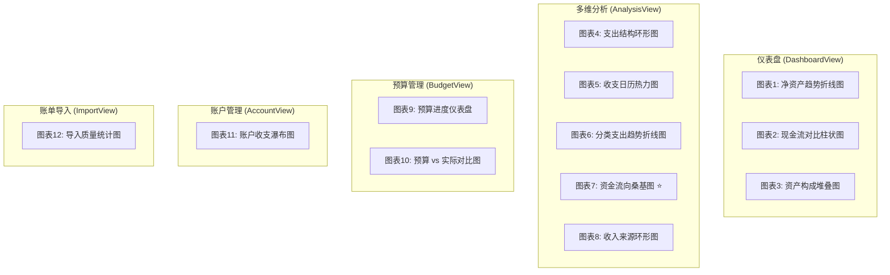
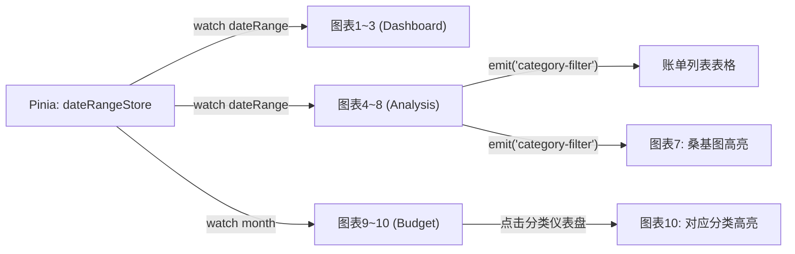

# ProjectMoneyX 数据可视化详细设计说明书

| 文档属性 | 详情 |
| --- | --- |
| **所属系统** | ProjectMoneyX 个人全景财务分析系统 |
| **关联文档** | [2-ProjectMoneyX-DDS.md](./2-ProjectMoneyX-DDS.md) §3 前端详细设计 |
| **技术框架** | ECharts 5.x + Vue3 Composition API + TypeScript |
| **编制日期** | 2026-02-26 |

---

## 0. 图表总览与需求覆盖矩阵

下表将 PRD 中的核心分析需求映射到具体图表实现，确保**多维度全覆盖**：

| PRD 需求 | 分析维度 | 实现图表 | 所在页面 |
|---|---|---|---|
| 资产负债表 | 总资产/负债/净资产趋势 | 图表1: 净资产趋势折线图 | Dashboard |
| 现金流概览 (MoM) | 月度收入 vs 支出对比 | 图表2: 现金流对比柱状图 | Dashboard |
| 各账户资产构成 | 账户维度的资金分布 | 图表3: 资产构成堆叠图 | Dashboard |
| 消费结构 (饼图) | 分类维度的支出占比 | 图表4: 支出结构环形图 | Analysis |
| 消费规律识别 | 时间维度的消费强度 | 图表5: 收支日历热力图 | Analysis |
| 分类趋势对比 | 分类×时间交叉分析 | 图表6: 分类支出趋势折线图 | Analysis |
| 资金流向 (Sankey) | 收入→账户→支出全链路 | 图表7: 资金流向桑基图 ⭐ | Analysis |
| 收入结构分析 | 收入来源维度的占比 | 图表8: 收入来源环形图 | Analysis |
| 预算管理 (阈值预警) | 预算执行进度 | 图表9: 预算进度仪表盘 | Budget |
| 预算执行趋势 | 预算 vs 实际的偏差跟踪 | 图表10: 预算 vs 实际对比图 | Budget |
| 账户交易分析 | 单账户维度的流水趋势 | 图表11: 账户收支瀑布图 | Account |
| 去重链路可视化 | ETL 导入质量监控 | 图表12: 导入质量统计图 | Import |

### 图表与页面分布



---

## 1. 仪表盘总览区 (DashboardView)

### 图表1：净资产趋势折线图

**图表类型：** `ECharts Line Chart`（面积折线图，Area Line）

**用途：** 展示净资产随时间的增长趋势，是资产健康度的核心指标。

| 配置项 | 说明 |
|---|---|
| `xAxis.type` | `'category'`，数据为月份标签 `['2024-06', ..., '2026-02']` |
| `yAxis.type` | `'value'`，单位 CNY，开启 `scale: true` 避免从0开始压缩曲线 |
| `series.type` | `'line'`，开启 `areaStyle` 填充半透明渐变区域 |
| `series.smooth` | `true`，平滑曲线更符合财务趋势感 |
| 关键数据字段 | `{ month: string, netWorth: number, totalAssets: number, totalLiabilities: number }[]` |
| 多线配置 | 叠加三条线：净资产（主线蓝 `#4F6EF7`）、总资产（绿虚线 `#10B981`）、总负债（红虚线 `#EF4444`），用 `markLine` 标注最高/最低点 |

**ECharts 高级能力：** 使用 `visualMap` 组件，当净资产低于某阈值时自动将线段变红预警。

**后端接口：** `GET /api/v1/dashboard/trend?range=12m`

```json
// Response
{
  "code": 0,
  "data": {
    "months": ["2025-03", "2025-04", "..."],
    "net_worth": [98000, 101000, "..."],
    "total_assets": [120000, 125000, "..."],
    "total_liabilities": [22000, 24000, "..."]
  }
}
```

---

### 图表2：月度现金流对比柱状图

**图表类型：** `ECharts Bar Chart`（分组柱 + 折线混合）

**用途：** 直观对比每月收入/支出，突出结余（净现金流）。

| 配置项 | 说明 |
|---|---|
| `xAxis` | 近12个月，`type: 'category'` |
| `series[0]` | 收入柱，`barMaxWidth: 20`，颜色 `#10B981`（绿） |
| `series[1]` | 支出柱，同组排列，颜色 `#EF4444`（红） |
| `series[2]` | 结余折线（叠加 `type: 'line'`），颜色 `#4F6EF7`（蓝），`z: 10` 置于顶层 |
| `tooltip.formatter` | 自定义：同时显示收入、支出、结余、环比变化（MoM%） |
| `markArea` | 标记亏损月（收入 < 支出）的柱背景为浅红色区域 |

**后端接口：** 复用 `GET /api/v1/dashboard/trend?range=12m`，数据中应增加 `month_income[]` 和 `month_expense[]` 数组。

---

### 图表3：资产构成堆叠柱 / 堆叠面积图

**图表类型：** `ECharts Bar Chart (stack)` 或 `Line Chart (stack + areaStyle)`

**用途：** 展示各账户资产随时间的构成变化，如活期、基金、信用卡负债各占比的演变。

| 配置项 | 说明 |
|---|---|
| `series[n].stack` | 统一设为 `'total'`，触发堆叠模式 |
| 账户数据字段 | `{ month, accounts: { name: string, balance: number }[] }[]` |
| `series` 中负债处理 | 负债账户（信用卡/白条）使用负值，自动向下延伸，形成正负对称的资产负债视图 |
| `legend` | 开启可点击切换，方便单独聚焦某账户 |

**后端接口：** `GET /api/v1/dashboard/asset-composition?range=12m`

```json
// Response
{
  "code": 0,
  "data": {
    "months": ["2025-03", "2025-04"],
    "series": [
      { "name": "招行储蓄卡", "type": "debit", "data": [80000, 82000] },
      { "name": "支付宝余额", "type": "ewallet", "data": [5000, 4500] },
      { "name": "招行信用卡", "type": "credit", "data": [-8000, -7500] }
    ]
  }
}
```

---

## 2. 支出分析区 (AnalysisView - Tab1: 支出)

### 图表4：支出结构环形图（Donut）

**图表类型：** `ECharts Pie Chart`（`radius: ['40%', '70%']` 环形）

**用途：** 展示选定时间段内各消费分类占比，支持二级下钻。

| 配置项 | 说明 |
|---|---|
| `series.radius` | `['40%', '70%']` 形成环形，中心显示总支出金额 |
| `series.label` | 外侧显示分类名 + 百分比，`labelLine` 引导线 |
| `graphic`（中心文字） | 使用 ECharts `graphic` 组件在环心渲染「总支出 / ¥9,820」 |
| `series.emphasis` | 鼠标悬停时扇区放大 `scaleSize: 10`，联动下方账单表格筛选 |
| 数据字段 | `{ name: string, value: number, percentage: number }[]` |
| 二级下钻 | 点击一级分类（餐饮）→ 触发 `series.data` 替换为二级分类（外卖/堂食/咖啡），配合 Vue3 `ref` 响应式切换，面包屑导航返回上级 |

**后端接口：** `GET /api/v1/analysis/category?type=expense&start_date=&end_date=&parent_id=`

```json
// Response
{
  "code": 0,
  "data": {
    "total": 9820.50,
    "items": [
      { "category_id": 1, "name": "餐饮", "value": 3200, "percentage": 32.6, "has_children": true },
      { "category_id": 2, "name": "购物", "value": 2500, "percentage": 25.5, "has_children": true },
      { "category_id": 3, "name": "交通", "value": 1200, "percentage": 12.2, "has_children": false }
    ]
  }
}
```

---

### 图表5：收支日历热力图

**图表类型：** `ECharts HeatMap`（日历坐标系）

**用途：** 以日历形式展示每日消费强度，快速识别高消费日/周期性支出规律（如固定还款日、周末消费高峰）。

| 配置项 | 说明 |
|---|---|
| `calendar.range` | 设置为当前选中月份或全年，如 `'2026'` 或 `'2026-02'` |
| `series.coordinateSystem` | `'calendar'`，与 `calendar` 组件绑定 |
| `series.data` | `[['2026-02-15', 420], ['2026-02-16', 85], ...]`（日期 + 消费金额） |
| `visualMap` | 连续型，从浅绿（低消费 `#E8F5E9`）到深红（高消费 `#C62828`）渐变，阈值按数据自适应 |
| `tooltip` | 显示该日消费总额和前3笔最大账单 |

**后端接口：** `GET /api/v1/analysis/heatmap?year=2026&type=expense`

```json
// Response
{
  "code": 0,
  "data": [
    ["2026-02-01", 156.50],
    ["2026-02-02", 320.00],
    ["2026-02-14", 899.00]
  ]
}
```

---

### 图表6：分类支出趋势多折线图

**图表类型：** `ECharts Line Chart`（多系列）

**用途：** 对比各支出分类（餐饮、购物、交通）近 N 个月的趋势，找出异常增长的分类。

| 配置项 | 说明 |
|---|---|
| `legend` | 开启可交互，默认只显示前5大分类，其余折叠于 `legend.selector` |
| `xAxis` | 月份，近12个月 |
| 每条 `series` | 对应一个支出分类，最多显示 6 条线，其余归入"其他" |
| `dataZoom` | 开启 X 轴缩放 (`type: 'slider'`)，支持拖拽查看任意时间段 |
| 颜色规范 | 自定义 10 色 palette，**与环形图(图表4)保持颜色一致**保证跨图表认知一致性 |
| `markPoint` | 自动标注各分类的月度最大值 (`type: 'max'`) |

**后端接口：** `GET /api/v1/analysis/category-trend?type=expense&range=12m&top=6`

```json
// Response
{
  "code": 0,
  "data": {
    "months": ["2025-03", "2025-04", "..."],
    "series": [
      { "name": "餐饮", "data": [3200, 2800, "..."] },
      { "name": "购物", "data": [2500, 3100, "..."] },
      { "name": "交通", "data": [1200, 1100, "..."] }
    ]
  }
}
```

---

## 3. 资金流向区 (AnalysisView - Tab2: 流向)

### 图表7：资金流向桑基图（Sankey）⭐ 核心图

**图表类型：** `ECharts Sankey Diagram`

**用途：** 唯一能完整展示「收入源 → 资金池(账户) → 支出分类」全链路的图表，是个人收支系统最有价值的可视化。

```typescript
// 核心数据结构（TypeScript）
interface SankeyNode {
  name: string          // 节点名称
  itemStyle?: { color: string }
  depth?: number        // 强制分层: 0=收入源, 1=账户, 2=支出分类
}

interface SankeyLink {
  source: string        // 来源节点 name
  target: string        // 目标节点 name
  value: number         // 流量金额（CNY）
}

// 三列节点分组示例
const nodes: SankeyNode[] = [
  // 收入源（左列, depth=0）
  { name: '工资薪酬', itemStyle: { color: '#10B981' }, depth: 0 },
  { name: '兼职收入', itemStyle: { color: '#34D399' }, depth: 0 },
  { name: '投资收益', itemStyle: { color: '#6EE7B7' }, depth: 0 },
  // 账户池（中列, depth=1）
  { name: '招行储蓄', itemStyle: { color: '#4F6EF7' }, depth: 1 },
  { name: '支付宝',   itemStyle: { color: '#818CF8' }, depth: 1 },
  { name: '微信钱包', itemStyle: { color: '#A5B4FC' }, depth: 1 },
  // 支出分类（右列, depth=2）
  { name: '餐饮',     itemStyle: { color: '#EF4444' }, depth: 2 },
  { name: '购物',     itemStyle: { color: '#F97316' }, depth: 2 },
  { name: '居住',     itemStyle: { color: '#F59E0B' }, depth: 2 },
  { name: '储蓄/投资',itemStyle: { color: '#10B981' }, depth: 2 },
]
```

| 关键配置项 | 说明 |
|---|---|
| `series.type` | `'sankey'` |
| `series.layout` | `'none'`（禁用自动布局），通过 `depth` 属性手动控制三列分层 |
| `series.nodeGap` | `12`（节点间距） |
| `series.nodeWidth` | `20`（节点宽度） |
| `series.lineStyle.color` | `'gradient'`（从源到目标渐变色，ECharts 内置支持） |
| `series.lineStyle.opacity` | `0.4`，悬停时 `emphasis.lineStyle.opacity: 0.8` |
| `series.emphasis.focus` | `'adjacency'`（高亮相邻节点和链接，淡化其他） |
| `series.label.position` | 左列 `'left'`，右列 `'right'`，中列 `'inside'` |
| `tooltip.formatter` | 自定义显示：节点→`账户名: 总额 ¥X,XXX`；链接→`源 → 目标: ¥X,XXX（占XX%）` |

**后端接口：** `GET /api/v1/analysis/sankey?start_date=&end_date=`（已在 DDS 中定义）

---

## 4. 收入分析区 (AnalysisView - Tab3: 收入)

### 图表8：收入来源环形图

**图表类型：** `ECharts Pie Chart`（`radius: ['40%', '70%']` 环形）

**用途：** 展示选定时间段内各收入来源占比（如：工资、兼职、理财收益、转账收款等），与支出环形图(图表4)形成对称分析。

| 配置项 | 说明 |
|---|---|
| `series.radius` | `['40%', '70%']` 形成环形，中心显示总收入金额 |
| `series.color` | 使用绿色系 palette（与支出红色系区分），如 `['#10B981', '#34D399', '#6EE7B7', '#A7F3D0']` |
| `graphic`（中心文字） | 在环心渲染「总收入 / ¥15,000」 |
| `series.emphasis` | 悬停扇区放大，tooltip 显示收入来源明细 |
| 数据字段 | `{ name: string, value: number, percentage: number }[]` |

**后端接口：** 复用 `GET /api/v1/analysis/category?type=income&start_date=&end_date=`

> **设计说明：** PRD 原文重点描述了支出维度的分析，但收入来源的结构分析是完整财务画像不可缺少的一环。用户需要了解"钱从哪来"的占比分布，才能做出更好的财务规划决策。

---

## 5. 预算管理区 (BudgetView)

### 图表9：预算进度仪表盘（多量规阵列）

**图表类型：** `ECharts Gauge Chart`（多个仪表盘组成阵列）

**用途：** 直观展示每个预算分类的执行进度百分比，配合 DDS 中定义的 80%/100% 阈值预警逻辑。

| 配置项 | 说明 |
|---|---|
| `series.type` | `'gauge'` |
| `series.progress.show` | `true`，显示进度弧 |
| `series.axisLine.lineStyle.color` | 三段式渐变：`[[0.8, '#10B981'], [1.0, '#F59E0B'], [1.0+, '#EF4444']]`（绿→橙→红） |
| `series.detail.formatter` | `'{value}%'`，中心显示百分比 |
| `series.title.text` | 分类名称（如"餐饮"、"交通"） |
| `series.data` | `[{ value: 75, name: '餐饮' }]`，表示已用 75% |
| 布局 | 使用 `v-row` + `v-col` 阵列，每个分类一个小仪表盘，全局预算用大号仪表盘 |

**阈值预警联动（对齐 DDS §4.2）：**
- `0% ~ 79%` → 绿色弧 `#10B981` + 正常文字
- `80% ~ 99%` → 橙色弧 `#F59E0B` + 橙色警告徽章
- `≥ 100%` → 红色弧 `#EF4444` + 红色超支提示 + 弧度超出刻度线

```typescript
// BudgetGauge.vue 核心 option
const getGaugeOption = (budget: BudgetItem): EChartsOption => ({
  series: [{
    type: 'gauge',
    startAngle: 200,
    endAngle: -20,
    min: 0,
    max: 100,
    progress: { show: true, width: 12 },
    pointer: { show: false },
    axisLine: {
      lineStyle: {
        width: 12,
        color: [[0.8, '#10B981'], [1, '#F59E0B'], [1.2, '#EF4444']]  // 允许超出100%
      }
    },
    axisTick: { show: false },
    splitLine: { show: false },
    axisLabel: { show: false },
    detail: {
      valueAnimation: true,
      formatter: `{value}%\n¥${budget.used} / ¥${budget.limit}`,
      fontSize: 14
    },
    title: { text: budget.categoryName, offsetCenter: [0, '80%'] },
    data: [{ value: Math.round((budget.used / budget.limit) * 100) }]
  }]
})
```

**后端接口：** `GET /api/v1/budgets?month=2026-02`（已在 DDS 中定义），响应需扩展：

```json
// Response
{
  "code": 0,
  "data": [
    {
      "id": 1, "category_name": "全局", "category_id": null,
      "limit": 10000, "used": 8200, "percentage": 82,
      "status": "warning"
    },
    {
      "id": 2, "category_name": "餐饮", "category_id": 1,
      "limit": 3000, "used": 2400, "percentage": 80,
      "status": "warning"
    },
    {
      "id": 3, "category_name": "交通", "category_id": 3,
      "limit": 1000, "used": 650, "percentage": 65,
      "status": "normal"
    }
  ]
}
```

---

### 图表10：预算 vs 实际对比柱状图

**图表类型：** `ECharts Bar Chart`（分组柱状图）

**用途：** 对比各分类的预算限额与实际支出，直观发现超支和节省的分类，辅助下月预算调整。

| 配置项 | 说明 |
|---|---|
| `xAxis` | 各预算分类名称 `type: 'category'` |
| `series[0]` | 预算限额柱，颜色 `#93C5FD`（浅蓝），`barMaxWidth: 24` |
| `series[1]` | 实际支出柱，颜色动态：未超支 `#10B981`（绿），超支 `#EF4444`（红） |
| `series[1].itemStyle.color` | 使用 `function(params)` 回调，根据是否超支动态着色 |
| `markLine` | 在 100% 预算位置画水平参考线 |
| `tooltip` | 显示：`分类名 | 预算: ¥X | 实际: ¥Y | 差额: ±¥Z (XX%)` |

**后端接口：** 复用 `GET /api/v1/budgets?month=2026-02`

---

## 6. 账户管理区 (AccountView)

### 图表11：账户收支瀑布图

**图表类型：** `ECharts Bar Chart`（瀑布图，使用透明柱实现）

**用途：** 展示选定账户在某月内余额的逐日/逐笔变化过程，帮助用户理解"钱是怎么花没的"。

| 配置项 | 说明 |
|---|---|
| 实现方式 | 使用 ECharts 堆叠柱模拟瀑布：底部透明柱 (`itemStyle.color: 'transparent'`) + 上方有色柱 |
| `xAxis` | 日期或交易序号 |
| 颜色逻辑 | 收入笔→绿色柱向上增长，支出笔→红色柱向下减少，最终柱→蓝色(期末余额) |
| `tooltip` | 显示：`日期 | 交易对方 | ±金额 | 余额` |
| `series.label` | 在柱体上方/下方显示金额增减 |

**后端接口：** `GET /api/v1/accounts/:id/waterfall?month=2026-02`

```json
// Response
{
  "code": 0,
  "data": {
    "account_name": "招行储蓄卡",
    "opening_balance": 80000,
    "closing_balance": 82500,
    "transactions": [
      { "date": "2026-02-01", "peer": "工资", "amount": 15000, "type": "income", "balance": 95000 },
      { "date": "2026-02-03", "peer": "房租", "amount": -5500, "type": "expense", "balance": 89500 },
      { "date": "2026-02-05", "peer": "美团外卖", "amount": -35, "type": "expense", "balance": 89465 }
    ]
  }
}
```

---

## 7. 导入质量区 (ImportView)

### 图表12：导入质量统计图

**图表类型：** `ECharts Bar Chart`（堆叠柱状图）

**用途：** 每次导入后展示本次及历史导入的数据质量分布（新增/去重/链路合并/失败），帮助用户监控 ETL 管道健康度。

| 配置项 | 说明 |
|---|---|
| `xAxis` | 导入批次（按时间倒序，最近 10 次） |
| `series[0]` | 新导入数，颜色 `#10B981`（绿），`stack: 'total'` |
| `series[1]` | 去重跳过数，颜色 `#F59E0B`（橙），`stack: 'total'` |
| `series[2]` | 链路合并数，颜色 `#4F6EF7`（蓝），`stack: 'total'` |
| `series[3]` | 失败数，颜色 `#EF4444`（红），`stack: 'total'` |
| `tooltip` | 显示各类明细和总解析条数 |

**后端接口：** `GET /api/v1/bills/import-history?limit=10`

```json
// Response
{
  "code": 0,
  "data": [
    {
      "batch_id": "20260226-001",
      "provider": "alipay",
      "imported_at": "2026-02-26T19:30:00+08:00",
      "total": 150, "imported": 132, "duplicated": 15, "linked": 3, "failed": 0
    }
  ]
}
```

---

## 8. 全局设计规范

### 8.1 统一色彩系统

为保证跨图表的**视觉一致性**和**认知连贯性**，所有图表使用统一的语义化色板：

| 语义 | 色值 | 用途场景 |
|---|---|---|
| **收入/正向/安全** | `#10B981` (Emerald-500) | 收入柱、正常进度、储蓄类 |
| **支出/负向/危险** | `#EF4444` (Red-500) | 支出柱、超支预警、失败 |
| **警告/临近阈值** | `#F59E0B` (Amber-500) | 80% 预算警告、去重跳过 |
| **中性/信息** | `#4F6EF7` (Indigo-500) | 结余线、链路合并、账户主色 |
| **辅助蓝** | `#818CF8` (Violet-400) | 辅助信息、次要指标 |
| **背景辅助** | `#F8FAFC` (Slate-50) | 图表背景、空白区域 |

**分类色板**（饼图/折线图/桑基图多分类通用，共 10 色循环）：

```typescript
const CATEGORY_PALETTE = [
  '#4F6EF7', '#10B981', '#F59E0B', '#EF4444', '#8B5CF6',
  '#EC4899', '#06B6D4', '#F97316', '#84CC16', '#6366F1'
]
```

### 8.2 ECharts 公共配置封装

```typescript
// composables/useECharts.ts
import * as echarts from 'echarts/core'
import { ref, onMounted, onUnmounted, watch } from 'vue'

export function useECharts(containerRef: Ref<HTMLElement | null>) {
  const chartInstance = ref<echarts.ECharts | null>(null)
  let resizeObserver: ResizeObserver | null = null

  onMounted(() => {
    if (containerRef.value) {
      chartInstance.value = echarts.init(containerRef.value)
      // 响应式 resize
      resizeObserver = new ResizeObserver(() => {
        chartInstance.value?.resize()
      })
      resizeObserver.observe(containerRef.value)
    }
  })

  onUnmounted(() => {
    resizeObserver?.disconnect()
    chartInstance.value?.dispose()
  })

  const setOption = (option: echarts.EChartsOption) => {
    chartInstance.value?.setOption(option, { notMerge: true })
  }

  return { chartInstance, setOption }
}
```

### 8.3 图表联动设计

12 张图在 Vue3 中的协作方式：



| 联动机制 | 实现方式 |
|---|---|
| **全局时间筛选器** | Pinia store 存储 `dateRange`，所有图表 `watch` 该变量触发 API 重新请求并刷新 |
| **分类联动** | 点击环形图扇区 → `emits('category-filter', categoryId)` → 账单表格过滤 + 桑基图高亮对应节点 |
| **图表 resize** | 统一在 `useECharts` composable 中使用 `ResizeObserver` 处理，配合 Vuetify 响应式断点 |
| **数据懒加载** | 桑基图和热力图数据量较大，使用 `defineAsyncComponent` 延迟渲染，进入视口后加载 |
| **颜色同步** | 跨图表的相同分类使用 `CATEGORY_PALETTE` 通过 `categoryId % 10` 索引取色，保证颜色映射一致 |

### 8.4 ECharts 组件注册清单

采用 ECharts 按需引入，减少打包体积：

```typescript
// plugins/echarts.ts
import * as echarts from 'echarts/core'
import {
  LineChart,      // 图表1, 6
  BarChart,        // 图表2, 3, 10, 11, 12
  PieChart,        // 图表4, 8
  HeatmapChart,    // 图表5
  SankeyChart,     // 图表7
  GaugeChart,      // 图表9
} from 'echarts/charts'
import {
  TitleComponent, TooltipComponent, LegendComponent,
  GridComponent, DataZoomComponent, VisualMapComponent,
  CalendarComponent, MarkLineComponent, MarkPointComponent,
  MarkAreaComponent, GraphicComponent, ToolboxComponent
} from 'echarts/components'
import { CanvasRenderer } from 'echarts/renderers'

echarts.use([
  LineChart, BarChart, PieChart, HeatmapChart, SankeyChart, GaugeChart,
  TitleComponent, TooltipComponent, LegendComponent,
  GridComponent, DataZoomComponent, VisualMapComponent,
  CalendarComponent, MarkLineComponent, MarkPointComponent,
  MarkAreaComponent, GraphicComponent, ToolboxComponent,
  CanvasRenderer
])

export default echarts
```

### 8.5 前端组件与后端 API 完整映射

| Vue 组件 | ECharts 图表类型 | 后端 API |
|---|---|---|
| `NetWorthTrendChart.vue` | Line (Area) | `GET /api/v1/dashboard/trend` |
| `CashFlowBarChart.vue` | Bar + Line (混合) | `GET /api/v1/dashboard/trend` |
| `AssetCompositionChart.vue` | Bar (Stack) | `GET /api/v1/dashboard/asset-composition` |
| `ExpensePieChart.vue` | Pie (Donut) | `GET /api/v1/analysis/category?type=expense` |
| `CalendarHeatmap.vue` | Heatmap (Calendar) | `GET /api/v1/analysis/heatmap` |
| `CategoryTrendChart.vue` | Line (Multi) | `GET /api/v1/analysis/category-trend` |
| `SankeyChart.vue` | Sankey | `GET /api/v1/analysis/sankey` |
| `IncomePieChart.vue` | Pie (Donut) | `GET /api/v1/analysis/category?type=income` |
| `BudgetGauge.vue` | Gauge | `GET /api/v1/budgets` |
| `BudgetCompareChart.vue` | Bar (Grouped) | `GET /api/v1/budgets` |
| `AccountWaterfallChart.vue` | Bar (Waterfall) | `GET /api/v1/accounts/:id/waterfall` |
| `ImportQualityChart.vue` | Bar (Stack) | `GET /api/v1/bills/import-history` |
